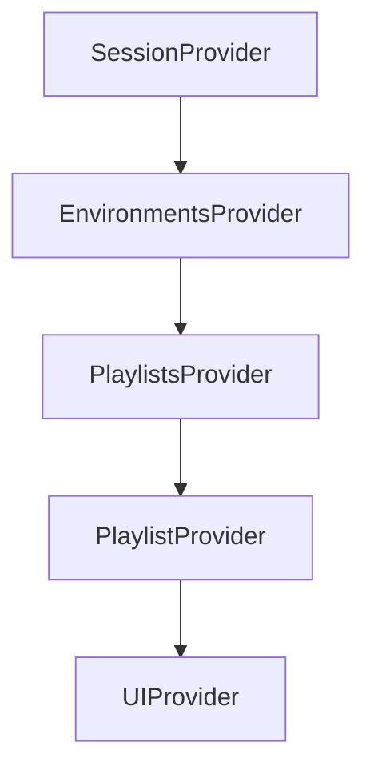
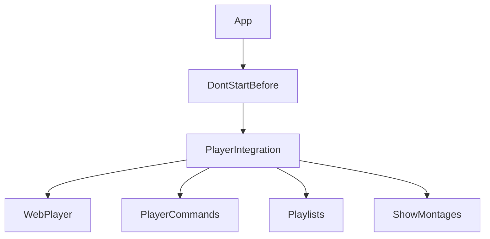
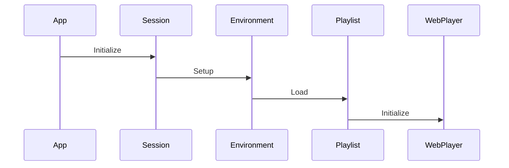

# CreateMontage V4 Development Rules

## 1. Core Architecture Principles

### Container Pattern

Follow the Player container architecture with hierarchical context providers:

```
App (UserContext)
└── SessionProvider
    └── EnvironmentsProvider
        └── PlaylistsProvider
            └── PlaylistProvider
                └── UIProvider
```

### State Management

- Use React Context for shared state across components
- Implement single source of truth for each data domain
- Handle loading and error states consistently
- Minimize prop drilling through context hierarchy

## 2. Component Structure Rules

### File Organization

```
src/
├── components/          # Reusable UI components
├── context/            # React Context providers
├── constants/          # Enums and static data
├── theme/             # Material-UI themes
├── utils/             # Helper functions
├── add/               # Add Contents feature
└── [feature]/         # Feature-specific folders
```

### Component Naming

- Use PascalCase for component files
- Prefix context files with the domain name
- Use descriptive names that indicate purpose

## 3. Tools System Architecture

### Current Implementation Pattern

Tools are implemented using:

- **Tool.js**: Styled Material-UI Paper component (200x200px) with `ToolContent` helper
- **ToolTypes.js**: Enum defining available tool types
- **Tools.js**: Container rendering all available tools
- **react-dnd**: Drag and drop functionality

### Tool Card Visual Structure

Each tool card follows a consistent layout:

```
┌─────────────────────────────┐
│                         (i) │  <- Info button (top-right)
│                             │
│         [ICON]              │  <- MUI icon (64px, colored)
│                             │
│       Tool Title            │  <- Primary text (body1, fontWeight 500)
│      subtitle               │  <- Secondary text (caption, italic)
│                             │
└─────────────────────────────┘
```

**Components:**
- **Icon**: MUI icon, 64px, with tool-specific color
- **Title**: Primary label describing the tool
- **Subtitle**: Optional italic text (e.g., "experimental")
- **Info button (i)**: Tooltip with detailed description on hover

### Current Tools

| Tool | Icon | Color | Status |
|------|------|-------|--------|
| **Title** | `TitleIcon` | #1976d2 (blue) | Active |
| **Zoom & Pan** | `CenterFocusStrongIcon` | #2adb68 (green) | Active, experimental |
| **Alpha Channel Inserts** | `PictureInPictureAltIcon` | #1976d2 (blue) | Active, experimental |
| **Space Image** | `ViewColumnIcon` | #8f2883 (purple) | Commented out, ready |

### Adding New Tools

#### Step 1: Add Tool Type

Add the new tool type to `src/components/constants/ToolTypes.js`:

```javascript
export const ToolTypes = {
  TITLE: 'title',
  ZOOM_AND_PAN: 'panzoom',
  SPACE_IMAGE: 'spaceImage',
  ALPHA_CHANNEL_INSERTS: 'alphaChannelInserts',
  NEW_TOOL: 'newTool',  // Add your new tool
};
```

#### Step 2: Create Tool Folder Structure

Create a folder for your tool: `src/components/tools/newTool/`

```
src/components/tools/
└── newTool/
    ├── NewTool.js        # Tool card component (drag source)
    └── NewToolDialog.js  # Configuration dialog (if needed)
```

#### Step 3: Create Tool Component

Create `NewTool.js` following this pattern:

```javascript
import { Tool, ToolContent } from "../Tool";
import * as React from "react";
import { useDrag } from "react-dnd";
import { DragableTypes } from "../../constants/DragableTypes";
import { BinTypes } from "../../constants/BinTypes";
import { ToolTypes } from "../../constants/ToolTypes";
import NewToolIcon from '@mui/icons-material/YourChosenIcon';
import { useTranslation } from 'react-i18next';

export default function NewTool({ handleFinishToolDragging }) {
    const { t } = useTranslation();

    const tool = {
        id: ToolTypes.NEW_TOOL,
        duration: "5",
        type: BinTypes.TOOL,
        toolType: ToolTypes.NEW_TOOL,
        displayName: t("tools.new-tool")
    };

    const [{ opacity }, dragRef] = useDrag(
        () => ({
            type: DragableTypes.PLAIN_TOOL,  // or DragableTypes.ARTWORK for title-like tools
            item: tool,
            collect: (monitor) => ({
                opacity: monitor.isDragging() ? 0.5 : 1
            }),
            end: (item, monitor) => handleFinishToolDragging(monitor.getDropResult(), tool.toolType),
        }),
        []
    );

    return (
        <Tool
            ref={dragRef}
            variant="outlined"
            square
            style={{ opacity }}
        >
            <ToolContent
                icon={<NewToolIcon />}
                title={t("tools.new-tool")}
                subtitle="experimental"  // Optional
                infoText={t("tools.new-tool.desc")}  // Info button tooltip
                iconColor="#yourColor"  // Tool-specific color
            />
        </Tool>
    );
}
```

#### Step 4: Add Translations

Add translations to `src/locales/en/translationEN.json` (and other language files):

```json
{
  "tools.new-tool": "New Tool",
  "tools.new-tool.desc": "Description of what this tool does"
}
```

#### Step 5: Register in Tools.js

Add your tool to `src/components/tools/Tools.js`:

```javascript
import NewTool from "./newTool/NewTool";

export default function Tools({ handleFinishToolDragging }) {
    return (
        <Stack sx={{ overflowY: "visible" }} cols={1}>
            <TitleTool />
            <ZoomAndPanTool handleFinishToolDragging={handleFinishToolDragging} />
            <AlphaChannelInsertsTool handleFinishToolDragging={handleFinishToolDragging} />
            <NewTool handleFinishToolDragging={handleFinishToolDragging} />
        </Stack>
    );
}
```

#### Step 6: Create Tool Dialog (if needed)

If your tool requires configuration, create a dialog component:

```javascript
// NewToolDialog.js
import { Dialog, DialogTitle, DialogContent, DialogActions, Button } from "@mui/material";

export default function NewToolDialog({ artwork, setArtwork, onSave }) {
    const handleClose = () => setArtwork(null);
    const handleSave = () => {
        // Save tool properties to artwork
        onSave(artwork);
        setArtwork(null);
    };

    return (
        <Dialog open={true} onClose={handleClose}>
            <DialogTitle>Configure New Tool</DialogTitle>
            <DialogContent>
                {/* Add configuration options */}
            </DialogContent>
            <DialogActions>
                <Button onClick={handleClose}>Cancel</Button>
                <Button onClick={handleSave}>Save</Button>
            </DialogActions>
        </Dialog>
    );
}
```

#### Step 7: Handle Tool Drop (Grid.js)

Register your tool's drop handling in `src/components/grid/Grid.js`:

1. Import and use your dialog when the tool is dropped
2. Add the tool type to the appropriate switch/case handling

### Drag Types

- **`DragableTypes.ARTWORK`**: For tools that create new artwork elements (like Title)
- **`DragableTypes.PLAIN_TOOL`**: For tools that modify existing artworks (like Zoom & Pan)

## 4. Data Structure Compliance

### Artwork Structure

```javascript
{
    id: string,
    duration: string,
    type: BinTypes.ARTWORK | BinTypes.TOOL,
    toolType?: ToolTypes,
    displayName: string,
    // ... other properties
}
```

### Montage Hierarchy

```
Playlist
└── Montages (sequenced array)
    └── Tracks (sequenced multigraph)
        └── Artworks (title, html, images, video)
```

## 5. Content Management Rules

### Rights System

Support copyright hierarchy:

- **Copyright (©)**: Full protection
- **Creative Commons**: Various license levels
- **Copy Left**: Free distribution

### Categories and Keywords

- Implement hierarchical category system
- Support multilingual descriptions
- Enable keyword-based search and filtering

### Credits System

Support multiple credit types:

- Author/Rights Holder
- Location
- Artwork Owner
- Photograph Credits
- Representation Rights (ADAGP, etc.)

## 6. Technical Standards

### State Management

- Use Context API for shared state
- Implement proper loading/error states
- Handle async operations with proper cleanup

### Internationalization

- Use react-i18next for all text
- Support multiple language descriptions
- Follow i18n key naming conventions

### Error Handling

- Implement Sentry error tracking
- Provide user-friendly error messages
- Use ErrorBoundary components

### Styling

- Use Material-UI theme system
- Follow consistent spacing/sizing (200x200px for tools)
- Implement responsive design patterns

## 7. Integration Rules

### Player Integration

- Maintain compatibility with webplayer architecture
- Support real-time synchronization
- Handle playlist state management

### API Integration

- Use consistent error handling
- Implement proper loading states
- Support chunk upload for large files

### Authentication

- Support demo/guest/premium account types
- Handle session management
- Implement proper authorization checks

## 8. Future Extensibility

### 3D/5D Works Support

Prepare architecture for:

- Drone capture integration
- Interactive sensor-based works
- Multi-screen diffusion
- WebGL/HTML5 interactive content

### Multi-Screen Architecture

Design for:

- Triptych displays
- Video walls
- Hospital room installations
- Immersive environments

## 9. Tools Extension Framework

The current tools system (`src/components/tools/Tools.js:7-20`) provides a clean extensibility
pattern:

### Current Tools

- **TitleTool**: Text overlay generation
- **ZoomAndPanTool**: Image zoom/pan effects with dialog configuration
- **AlphaChannelInsertsTool**: Layer composition effects
- **SpaceImageTool**: Commented out, ready for implementation

### Extension Pattern for New Tools

```javascript
// 1. Add to ToolTypes enum
export const ToolTypes = {
  NEW_EFFECT: 'newEffect',
};

// 2. Create tool component
export default function NewEffectTool({ handleFinishToolDragging }) {
  // Follow TitleTool pattern for drag implementation
  // Use dialog pattern from ZoomAndPanTool if configuration needed
}

// 3. Add to Tools.js stack
<NewEffectTool handleFinishToolDragging={handleFinishToolDragging} />;
```

The framework supports both simple tools (like Title) and complex configurable tools (like
ZoomAndPan with dialog interfaces).

## 10. Player Container Architecture Reference

### Wallmuse Player Container Architecture

#### 1. Core Context Providers



#### 2. Data Flow Hierarchy

```
SessionContext (User/House)
└── EnvironmentsContext (Devices/Screens)
    └── PlaylistsContext (Content)
        └── PlaylistContext (Individual Playlist State)
            └── UIContext (UI State)
```

#### 3. Key Components and Their Roles

##### a) SessionContext (`src/contexts/SessionContext.js`)

- Manages user authentication and session state
- Handles account types (Demo, Guest, Premium)
- Stores house information
- Provides `isLoggedIn`, `isDemo`, `isPremium` flags

##### b) EnvironmentsContext (`src/contexts/EnvironmentsContext.js`)

- Manages devices and screens
- Handles playlist synchronization
- Controls current playlist state
- Manages environment setup and cleanup

##### c) PlaylistsContext (`src/contexts/PlaylistsContext.js`)

- Manages playlist data
- Handles playlist loading and updates
- Provides playlist state to components

##### d) PlaylistContext (`src/Playlists/contexts/PlaylistContext.js`)

- Manages individual playlist operations
- Handles save/delete states
- Provides UI feedback for playlist operations

#### 4. Component Structure



#### 5. Key Features

##### a) Account Management

- Demo accounts have limited functionality
- Guest accounts can be upgraded to full accounts
- Premium accounts have full access

##### b) Playlist Management

- Hierarchical structure: Playlist → Montages → Tracks → Artworks
- Supports synchronization between frontend and backend
- Handles temporary playlists for preview

##### c) Environment Management

- Supports multiple devices (PC, mobile, tablet)
- Handles screen permissions
- Manages device-specific configurations

#### 6. State Management Rules

##### a) Session State

- Managed by SessionContext
- Persists across page reloads
- Handles account creation and upgrades

##### b) Environment State

- Managed by EnvironmentsContext
- Syncs with backend
- Handles device-specific settings

##### c) Playlist State

- Managed by PlaylistsContext
- Supports real-time updates
- Handles synchronization with backend

#### 7. Initialization Flow



#### 8. Best Practices

##### a) State Updates

- Use context for shared state
- Minimize prop drilling
- Handle loading and error states

##### b) Component Communication

- Use context for shared data
- Use callbacks for actions
- Handle cleanup properly

##### c) Error Handling

- Use ErrorBoundary components
- Provide user feedback
- Log errors appropriately

#### 9. Account Structure

##### 9.1 Hierarchy

```
Account
└── Houses (locations, one house currently implemented)
    └── Environments (devices)
        └── Screens (PC multiple possible, Web not supported although theoretically possible if not same browser)
```

##### 9.2 Components

- **Account**: Top-level entity containing houses
- **House**:
  - Represents a physical location
  - Has a default playlist (id can be undefined)
  - Can have multiple environments
- **Environment**:
  - Represents a device (PC, mobile, etc.)
  - PC environments can have multiple displays
  - Each environment can run the webplayer

##### 9.3 Deployment Models

- **Web Container**: Current implementation
  - Runs in web browser
  - Managed by container application
  - Communicates via WebSocket
- **Desktop Application**: Future implementation
  - Will replace current Java-based player
  - Will use Electron framework
  - Will maintain same core functionality

#### 10. Core Data Structure

The Wallmuse Webplayer follows a hierarchical structure for content organization:

```
Playlist
└── Montages (sequenced array)
    └── Tracks (sequenced multigraph)
        └── Artworks (title, html, images, video)
```

#### 11. Component Architecture

##### 11.1 Playlist

- **Class**: `Playlist` (`src/dao/Playlist.ts`)
- **Purpose**: Manages sequence of montages
- **Key Properties**:
  - `id`: Unique identifier
  - `name`: Playlist name
  - `montages`: Array of MontageLight objects
  - `random`: Boolean for random playback (default: false)
  - `loop`: Boolean for loop playback (default: false)
- **Playback Behavior**:
  - Autoplay by default - does not require explicit play command
  - Loop explicitly enabled
  - Random playback must be explicitly enabled

##### 11.2 Montage

- **Purpose**: Contains synchronized tracks
- **Key Properties**:
  - `seqs`: Array of Tracks
  - `screens`: Array of Screen mappings
- **Functionality**:
  - Track synchronization
  - Screen mapping
  - Track selection logic

##### 11.3 Track

- **Key Features**:
  - Synchronized with other tracks
  - Screen mapping
  - Item sequence management

##### 11.4 Artwork

- **Types**: VID, IMG, AUD, HTML, TEXT
- **Key Properties**:
  - `title`: Content title
  - `type`: Media type
  - `url`: Media location
  - `width/height`: Dimensions
  - `duration`: Playback length

#### 12. Container handling a webplayer written in TS

## 11. Content Management User Manual Context

### Creating Montages and Specifying Contents/Artworks

#### Contents or Artworks' Specifications

In curate > add contents, the following field asks for details on the original digital artwork's
location and rights. An artwork has three formats:

- Its high definition (HD) or ultra-high definition (UHD or 4K) formats, which are encrypted and
  locked to avoid copying
- Its standard definition (SD) format, which is optional and can be displayed freely over the
  Internet
- Its Thumbnail

#### Specify Contents Different Parts

Most image and audio/video formats are supported. SD and Thumbnail formats are generated
automatically, although specific ones may be used by selecting SD or Thumbnail check boxes.

#### Categories and Keywords

Various categories may be selected to describe an artwork, covering most relevant parts of a given
theme/domain/cultural practices. These categories are editable for administrator accounts.

Keywords are also available, which allow users to create and manage them more easily in view of
creating Montages e.g.: Women in art; Movement

#### Rights

Enter Rights by pressing (+) that becomes its section 3.

The table below explains the various rights you can choose from for each artwork, especially for
HD/UHD formats that are encrypted, also Thumbnail, SD formats that are optional.

| Name             | Logo | Acronym     | Explanation and Details                                                                                                                                                                         |
| ---------------- | ---- | ----------- | ----------------------------------------------------------------------------------------------------------------------------------------------------------------------------------------------- |
| Copyright        | ©   | CR          | Specific to States. May include moral rights towards internet use                                                                                                                               |
| Copy left        | ⊆    | CL          | Others may freely copy, distribute and transform creative works without the author's explicit permission                                                                                        |
| Creative Commons | CC   | CC BY       | Attribution (by): Others can copy, distribute, transmit the work but only if they give credit. Others can make derivative works (remixing, adapting the work), make commercial use of the work. |
|                  |      | CC BY-ND    | Others may not alter, transform, or build upon this work.                                                                                                                                       |
|                  |      | CC BY-NC-SA | Others may distribute the resulting work only under the same or similar license as the original.                                                                                                |
|                  |      | CC BY-SA    | Others may distribute the resulting work only under the same or similar license as the original.                                                                                                |
|                  |      | CC BY-NC    | Others may not use this work for commercial purposes.                                                                                                                                           |
|                  |      | CC BY-NC-ND | Others may not alter, transform, or build upon this work                                                                                                                                        |

Artworks specified as Copyright and Creative Commons (CC) with No Derivatives (ND) cannot be
re-used, so these will not be available to other users to create Montages. Other artwork rights
allow re-usage, so these artworks would be available to others to curate exhibitions.

#### Credits

Different Credits are proposed after pressing (+) which becomes its section 4. These include:

- Author or Rights Holder which may be additional to the Author, for instance with artist
  foundations. These have moral rights on broadcasting even in purchased by a museum for example
- Location is the place of the art
- Artwork Owner has no broadcasting rights unless within his premises, and so indicated in credits
  separately
- Photograph credits are indicated and rarely have rights as such. If so, these should be indicated
  above in Rights
- Representation Rights are organizations such as ADAGP (FR), BILDKUNST (DE), COPY-DAN (DK), DACS
  (UK), SIAE (IT), SPA (PT), VAGA (US), VEGAP (ES) and others. These indicate whether
  representation/broadcasts/internet are possible or not

Credits may be determined for all countries or a selection of countries. When all is specified,
press the Submit button. Entering information for another artwork or content will keep previous
details unless page is refreshed.

### List and Modify Contents

curate > list contents page allows you to review all artworks available to your account. Pressing on
a Thumbnail of an artwork will redirect you to Modify Contents page for that given artwork.

### Create Exhibitions

In curate > curate exhibitions or by selecting the above Montage > button, the Montage creation tool
is presented.

It comprises a left column where you can find artworks or existing Montages which can be dragged and
dropped to create a Montage in the larger section on the right.

The top part gives information about the created Montage.

Select the Full Screen mode indicated on the top right button, as it is more convenient to create
Montages using the full screen feature.

The left column, where artworks or existing Montages may be accessed, comprises your artworks and
Montages as well as artworks and Montages which rights allow re-usage.

In Search, type for example "XX" to find artworks which title comprises "XX". Use the scroll bar to
select the desired artworks if several correspond to your search. Note that "Create new" is selected
by default.

Scroll down to find artworks and drag and drop them in the desired position and on the desired
Screen Track. Adding an artwork vertically onto an empty line will automatically create a new Screen
Track.

#### Title Tool

In Tools, you may drag and drop Title into a Montage and by editing it can set preferences for such
insertions.

#### Saving a Montage

The top right part of the Montage indicates the number of Screen Tracks. The Duration and End Times
of a Screen Track are indicated.

Existing Montages can also be dragged and dropped to produce a Montage. However, the Screen Tracks
needed to drop the Montage with multiple Tracks should have the same End Times to allow correct
placement of the Montage and its different Tracks.

#### Information and Rights of a Montage's Curation

At the top part of Create Montage, a Thumbnail must be created. Double click on an artwork, and its
Thumbnail will appear to represent the Montage. Enter a Title and a description for the Montage,
after having indicated its language. Descriptions in multiple languages are possible and
recommended. An English description will allow a wider understanding of a Montage by an
international audience.

Other details that can be specified include:

- Art categories (same as those of artworks)
- Language details
- If not suitable for children, please uncheck

When complete, press Save. A confirmation box will appear indicating the duration of the Montage.

Compatibility of rights are needed for broadcasting. Incompatibilities occur for instance when the
different artworks and Montage curation's rights do not concur. Compatibility is managed through:

- Types of rights and pending authorizations
- Modifications to the Montage
- Broadcasting to given countries
- Adaptation for youth and children

## 12. Ongoing Developments - Future Vision

### 2D/3D Works and Multi-Screen Diffusion

Currently, WallMuse mainly displays 2D images (paintings, drawings, photos) with timed sequences and
random Ken Burns effects.

Next step: complementary and parallel diffusion across multiple screens (e.g. triptychs, video
walls, hospital rooms, immersive installations).

Technical enhancements:

- Fine-tuned intra-image trajectories (like video keyframes: zoom, X/Y orientation, progressive
  movement)
- Enlargements up to ×4 for 2D images, up to 8K for HD video
- Advanced multi-OS configuration (Windows, Mac, Linux, Android, iOS) via a dedicated 2D interface

### Interactive 3D and 5D Works

#### 3D (capturing installations, sculptures, heritage sites):

- Drone/flight captures (circular, multi-height, crossing trajectories)
- Example: Catène de Containers by Vincent Ganivet (Le Havre, 2017)
- Integration with smartphones linked to a WallMuse account: navigation between video sequences by
  geolocation (longitude, latitude, altitude)
- Automatic commands generated in the exhibition timeline

#### 5D (interactive digital works using sensors):

- Artists using Processing, Pure Data, or custom libraries
- Sensitive works using dozens of different sensors (IoT, mobile, dedicated hardware)
- Challenge: diffusion is rare due to technical constraints (artist presence often required)
- Proposal: transpose existing interactive works into HTML5/WebGL, document the steps, and share
  specifications (sensors, WallMuse commands)

### Documentation and Openness

- Open-source code available on GitHub, with documentation for web services and servers
- Publication of experiences (3D in free access, 5D under copyright)
- Documentation of commands on GitHub to encourage international cooperation and mutual enrichment

## 13. Shared Components Impact Analysis ⚠️

### Critical Shared Components

These components are used by BOTH Create Montage and Add/List Contents sections. Changes to these
require testing in both contexts:

#### Core Shared Components:

1. **`components/details/Descriptions.js`**
   - Used in: Grid.js (Create Montage) and AddContent.js (Add Contents)
   - Impact: Description management for both montages and individual artworks

2. **`components/categories/Categories.js`**
   - Used in: Grid.js (Create Montage) and AddContent.js (Add Contents)
   - Impact: Category selection for both montages and individual artworks

3. **`components/details/Rights.js`**
   - Used in: Grid.js (Create Montage) and AddContent.js (Add Contents)
   - Impact: Rights management for both montages and individual artworks

4. **`components/details/useCountries.js`**
   - Used in: AddContent.js (Add Contents) and Credits.js (Add Contents)
   - Impact: Country selection functionality

#### Constants and Utilities:

5. **`components/constants/Literals.js`**
   - Used across both sections for shared constant values

6. **`components/constants/ArtworkTypes.js`**
   - Used in both AddContentController.js and potentially Grid.js

7. **`utils/Utils.js`** (getUserId function)
   - Used across both sections for authentication

#### Separate But Similar Components:

- **SearchArea**: Create Montage uses `components/searchArea/SearchArea.js`
- **ContentsSearchArea**: Add Contents uses `add/searcharea/ContentsSearchArea.js`
- **ArtworkList**: Only used in Create Montage section
- **Details**: Only used in Create Montage section (different from individual component details)

### ⚠️ Change Impact Rules:

#### HIGH IMPACT (Test Both Sections):

- Any changes to `Descriptions`, `Categories`, `Rights`, `useCountries`
- Changes to shared constants in `Literals.js` or `ArtworkTypes.js`
- Theme changes that affect both sections
- API changes that affect both artwork and montage operations

#### MEDIUM IMPACT (Section-Specific):

- Changes to `SearchArea` only affect Create Montage
- Changes to `ContentsSearchArea` only affect Add Contents
- Changes to `ArtworkList` only affect Create Montage
- Changes to tools only affect Create Montage

#### LOW IMPACT:

- Changes to section-specific CSS files
- Changes to section-specific utility functions

### Testing Strategy:

1. **For shared component changes**: Test both Create Montage workflow AND Add Contents workflow
2. **For section-specific changes**: Test only the relevant section
3. **For API changes**: Verify both montage creation and content addition still work
4. **For theme changes**: Test visual consistency across both sections

---

## Getting Started for New Developers

1. **Read this document thoroughly**
2. **Examine the existing codebase structure**
3. **Pay special attention to shared components (Section 13)**
4. **Start with small tool implementations to understand the pattern**
5. **Follow the Player container architecture for any major architectural changes**
6. **Maintain backward compatibility with existing montage data structures**
7. **Use the established internationalization patterns**
8. **Test tools integration with the drag-and-drop system**
9. **Ensure proper error handling and user feedback**
10. **Always test both sections when modifying shared components**
