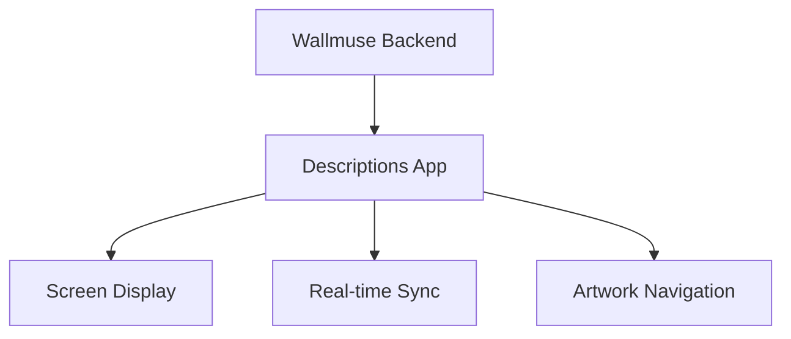

# Wallmuse Descriptions App Architecture

## 1. Overview

The Descriptions App is a React-based real-time display application that shows artwork information
for specific screens within the Wallmuse ecosystem. It provides a synchronized view of current
artwork details including images, descriptions, and metadata.



## 2. Core Architecture

### 2.1 Application Structure

```
Descriptions App
├── API Layer (src/utils/api.js)
├── Theme System (src/theme/)
├── Utilities (src/utils/Utils.js)
├── Internationalization (src/i18n.js)
└── Main App Component (src/App.js)
```

### 2.2 Data Flow

```
URL Parameters (screen)
└── API Fetch (currentArtworks)
    └── XML to JSON Conversion
        └── Timing Calculation
            └── Real-time Display Updates
```

## 3. Key Components

### 3.1 Main App Component (`src/App.js`)

**Purpose**: Primary container managing state and rendering **Key Features**:

- Real-time artwork synchronization
- Navigation controls (previous/next)
- Timeline slider for manual navigation
- Automatic artwork transitions based on timing

**State Management**:

- `artworks`: Processed artwork data with timing
- `currentArtworkIndex`: Current displayed artwork index
- `counter`: Elapsed time counter for synchronization
- `duration`: Total playlist duration

### 3.2 API Layer (`src/utils/api.js`)

**Purpose**: Backend communication and data processing **Key Functions**:

#### `detailsUser()`

- Fetches user account, house, environments, and screen data
- Returns structured user context for the application

#### `currentArtworks(screen)`

- Fetches artwork data for specific screen
- Converts XML response to JSON
- Processes timing calculations
- Returns array of artworks with metadata

### 3.3 Theme System (`src/theme/ThemeUtils.js`)

**Purpose**: Dynamic theming based on subdomain **Supported Themes**:

- `wallmuse` (default)
- `sharex`
- `ooo2`

**Theme Selection Logic**:

```javascript
subdomain = URL.split('//')[1]?.split('.')[0];
theme = subdomain || 'wallmuse';
```

### 3.4 Utilities (`src/utils/Utils.js`)

**Purpose**: Common utility functions **Key Functions**:

- `getUserId()`: Extracts user session from DOM or URL
- `wmm_url`: Current domain URL
- `rootElementId`: DOM element identifier

## 4. Data Structure

### 4.1 Artwork Object

```javascript
{
  id: string,
  title: string,
  startTime: number,      // Calculated timing
  endTime: number,        // Calculated timing
  datation_start: string,
  datation_end: string,
  datation_kind: string,
  author: string,
  description: string,    // HTML content
  location: string,
  owner: string,
  capture: string,
  image_url: string
}
```

### 4.2 Timing Calculation

```javascript
// Sequential timing calculation
let startTime = 0;
artworks.map(artwork => {
  const duration = parseFloat(artwork.duration);
  const offset = parseFloat(artwork.offset);
  const endTime = startTime + duration + offset;

  startTime = endTime; // Next artwork start time
  return { ...artwork, startTime, endTime };
});
```

## 5. Real-time Synchronization

### 5.1 Time Tracking System

- **Counter Updates**: Every 1000ms interval
- **Artwork Transitions**: Automatic when `counter >= artwork.endTime`
- **Loop Behavior**: Resets counter and cycles through artworks

### 5.2 Current Limitations ⚠️

- **Client-side timing**: Relies on browser intervals (not server sync)
- **Drift potential**: Long-running sessions may accumulate timing errors
- **Network delays**: API calls can introduce synchronization gaps
- **Browser focus**: Intervals may pause when tab loses focus

## 6. User Interface

### 6.1 Layout Structure

```
Grid Container (100vh)
├── Previous Button (2 cols)
├── Artwork Display (8 cols)
│   ├── Title
│   ├── Datation
│   ├── Image
│   ├── Author
│   ├── Description (scrollable)
│   └── Footer (Location/Owner/Capture)
└── Next Button (2 cols)
└── Timeline Slider (12 cols)
```

### 6.2 Navigation Features

- **Manual Navigation**: Previous/Next buttons
- **Timeline Slider**: Direct time position selection
- **Auto-scroll**: Smooth scroll to active artwork
- **Responsive**: Material-UI Grid system

## 7. Integration with Wallmuse Ecosystem

### 7.1 Screen Parameter System

- **URL Parameter**: `?screen=screen_id`
- **Purpose**: Identifies specific display target
- **API Integration**: Passed to `currentArtworks(screen)` endpoint

### 7.2 Session Management

- **User Session**: Retrieved via `getUserId()`
- **Backend URL**: `https://wallmuse.com:8443/wallmuse/ws`
- **Authentication**: Session-based API calls

## 8. Deployment Configuration

### 8.1 Build Configuration

```json
{
  "scripts": {
    "start": "react-scripts start",
    "build": "react-scripts build",
    "test": "react-scripts test"
  }
}
```

### 8.2 Dependencies

- **React 18.2.0**: Core framework
- **Material-UI**: UI components and theming
- **Axios**: HTTP client for API calls
- **xml-js**: XML to JSON conversion
- **react-i18next**: Internationalization

## 9. Known Issues and Improvements

### 9.1 Time Synchronization Limitations

**Current Issues**:

- Client-side timing implementation
- Potential drift over extended periods
- Browser tab focus dependency
- Network latency not accounted for

**Recommended Improvements**:

- Server-side time synchronization
- WebSocket real-time updates
- Heartbeat mechanism for timing correction
- Offline state handling

### 9.2 Performance Considerations

**Current**:

- Interval-based updates every 1000ms
- Full artwork array processing on each update

**Improvements**:

- Event-driven updates instead of polling
- Memoization for expensive calculations
- Virtual scrolling for large artwork lists
- Image preloading optimization

### 9.3 Error Handling

**Current**:

- Basic try-catch blocks
- Console logging for debugging

**Improvements**:

- User-friendly error messages
- Retry mechanisms for API failures
- Graceful degradation for missing data
- Error boundary components

## 10. Development Guidelines

### 10.1 Code Conventions

- **File Structure**: Follow existing component organization
- **Naming**: Use descriptive variable names with artwork context
- **Styling**: Material-UI theme system integration
- **State Management**: React hooks for local state

### 10.2 API Integration

- **Error Handling**: Always wrap API calls in try-catch
- **Response Validation**: Check for expected data structure
- **Logging**: Include relevant debugging information
- **Session Management**: Use provided `getUserId()` utility

### 10.3 Testing Considerations

- **Screen Parameters**: Test with various screen IDs
- **Timing Edge Cases**: Test artwork transitions
- **Error Scenarios**: Test network failures and invalid data
- **Cross-browser**: Verify timing accuracy across browsers

## 11. Future Enhancements

### 11.1 Real-time Synchronization

- Implement WebSocket connection for server push updates
- Add server timestamp synchronization
- Include network latency compensation

### 11.2 Enhanced User Experience

- Add artwork transition animations
- Implement gesture-based navigation
- Include accessibility improvements
- Add fullscreen mode support

### 11.3 Performance Optimization

- Implement virtual scrolling for large datasets
- Add image lazy loading and preloading
- Optimize rendering with React.memo
- Add service worker for offline capability

---

_Generated for Wallmuse Descriptions App - Real-time artwork display system_
