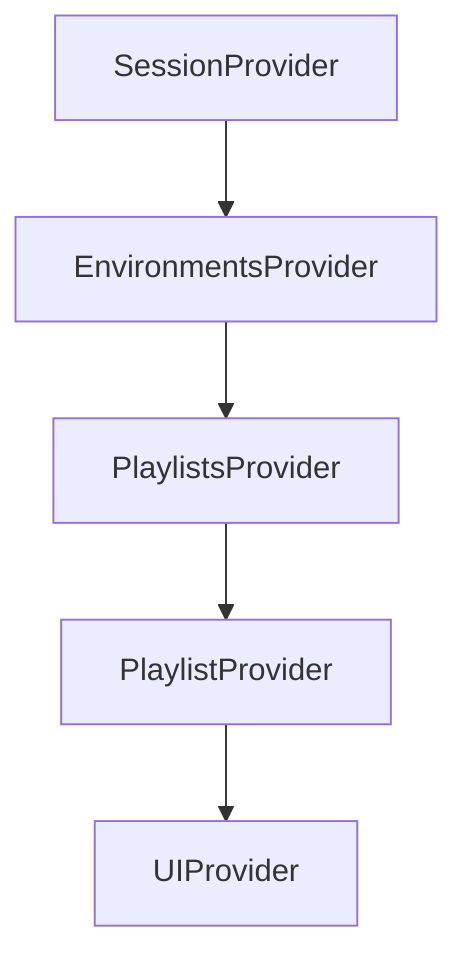

# Wallmuse Player Container Development Rules

## 1. Overview

The Wallmuse Player Container is a React-based application that manages the Wallmuse ecosystem's
core functionality including user sessions, environments, playlists, and the embedded WebPlayer
component.

## 2. Architecture Principles

### 2.1 Context Provider Hierarchy



### 2.2 Data Flow Hierarchy

```
SessionContext (User/House)
└── EnvironmentsContext (Devices/Screens)
    └── PlaylistsContext (Content)
        └── PlaylistContext (Individual Playlist State)
            └── UIContext (UI State)
```

## 3. Core Components

### 3.1 SessionContext (`src/contexts/SessionContext.js`)

**Purpose**: Manages user authentication and session state **Key Features**:

- User authentication and session management
- Account types (Demo, Guest, Premium)
- House information storage
- Session persistence across page reloads

**Key Properties**:

- `isLoggedIn`: Boolean authentication state
- `isDemo`: Demo account flag
- `isPremium`: Premium account flag
- `house`: Current house information

### 3.2 EnvironmentsContext (`src/contexts/EnvironmentsContext.js`)

**Purpose**: Manages devices and screens **Key Features**:

- Device environment management
- Screen configuration and permissions
- Playlist synchronization
- Environment setup and cleanup

**Key Properties**:

- `environments`: Array of device environments
- `currentEnvironment`: Active environment reference
- `screens`: Available screens for current environment

### 3.3 PlaylistsContext (`src/contexts/PlaylistsContext.js`)

**Purpose**: Manages playlist data and operations **Key Features**:

- Playlist loading and updates
- Real-time synchronization
- Playlist state management
- Content hierarchy management

**Key Properties**:

- `playlists`: Array of available playlists
- `currentPlaylist`: Currently active playlist
- `playlistState`: Playback state information

### 3.4 PlaylistContext (`src/Playlists/contexts/PlaylistContext.js`)

**Purpose**: Manages individual playlist operations **Key Features**:

- Save/delete operations
- UI feedback for playlist changes
- Individual playlist state management
- Error handling for playlist operations

## 4. Account Structure

### 4.1 Hierarchy

```
Account
└── Houses (locations, one house currently implemented)
    └── Environments (devices)
        └── Screens (PC multiple possible, Web not supported)
```

### 4.2 Account Types

- **Demo Accounts**: Limited functionality, no permission requests
- **Guest Accounts**: Can be upgraded to full accounts
- **Premium Accounts**: Full access to all features
- **Free Accounts**: Full access (wallmuse site freemium approach)

### 4.3 Environment Management

- **Active Environment**: `alive === "1"`
- **Inactive Environment**: `alive === "0"`
- **Active Screen**: `on === "1"`
- **Inactive Screen**: `on === "0"`

## 5. Development Standards

### 5.1 State Management Rules

- Use Context API for shared state
- Minimize prop drilling through context hierarchy
- Handle loading and error states consistently
- Implement proper cleanup in component unmounting

### 5.2 Component Communication

- Use context for shared data
- Use callbacks for actions
- Handle cleanup properly
- Maintain component isolation

### 5.3 Error Handling

- Use ErrorBoundary components
- Provide user-friendly error messages
- Log errors appropriately
- Implement graceful degradation

## 6. Integration with WebPlayer

### 6.1 Communication Architecture

**CRITICAL**: All parent-webplayer communication flows through NAV commands

```
Parent Application (NavigationManager.js)
└── NAV Commands via 'webplayer-navigate' events
    └── React Webplayer (index.tsx)
        └── WebSocket data delivery
            └── Sequencer execution
```

### 6.2 Parent-Child Responsibilities

**Parent Application (React)**:

- Creates environments via REST API
- Creates screens via REST API
- Activates screens via REST API
- Manages user interface and navigation

**Child WebPlayer (TypeScript)**:

- Generates environment keys from crypt_key
- Establishes WebSocket connections
- Handles media playback
- Manages real-time synchronization

### 6.3 Communication Mechanisms

1. **URL Parameters**: Environment context passing
2. **Global Variables**: Cross-application state sharing
3. **Event System**: Bidirectional communication
4. **Shared Utilities**: Consistent logic across applications

## 7. Data Structure

### 7.1 Core Data Hierarchy

```
Playlist
└── Montages (sequenced array)
    └── Tracks (sequenced multigraph)
        └── Artworks (title, html, images, video)
```

### 7.2 Playlist Properties

- `id`: Unique identifier (can be undefined for default playlists)
- `name`: Playlist name
- `montages`: Array of MontageLight objects
- `random`: Boolean for random playback (default: false)
- `loop`: Boolean for loop playback (default: false)

### 7.3 Montage Properties

- `seqs`: Array of Tracks
- `screens`: Array of Screen mappings
- Track synchronization capabilities
- Screen mapping functionality

## 8. Performance Considerations

### 8.1 State Updates

- Use context for shared state
- Minimize unnecessary re-renders
- Implement proper memoization
- Handle async operations efficiently

### 8.2 Memory Management

- Clear unused references during cleanup
- Implement proper component unmounting
- Use loading locks to prevent resource exhaustion
- Monitor for memory leaks

### 8.3 Network Optimization

- Throttle API calls appropriately
- Implement proper caching strategies
- Handle network failures gracefully
- Optimize WebSocket communication

## 9. Testing Guidelines

### 9.1 Unit Testing

- Test individual context providers
- Test component state management
- Test API integration functions
- Test error handling scenarios

### 9.2 Integration Testing

- Test context provider interactions
- Test parent-child communication
- Test playlist switching workflows
- Test environment management flows

### 9.3 User Flow Testing

- Test account creation and management
- Test playlist operations
- Test environment setup and configuration
- Test WebPlayer integration

## 10. Deployment Considerations

### 10.1 Environment Configuration

- Proper environment variable setup
- API endpoint configuration
- WebSocket connection settings
- Error tracking configuration

### 10.2 Build Process

- React build optimization
- Asset bundling and optimization
- Environment-specific builds
- Deployment pipeline configuration

---

## Appendix A: Troubleshooting Guide

_See [PLAYER_CONTAINER_TROUBLESHOOTING.md](./PLAYER_CONTAINER_TROUBLESHOOTING.md) for detailed
troubleshooting information including:_

- Common issues and solutions
- Debug procedures
- Error recovery mechanisms
- Performance optimization techniques
- Account creation troubleshooting
- Environment management issues
- WebPlayer integration problems
