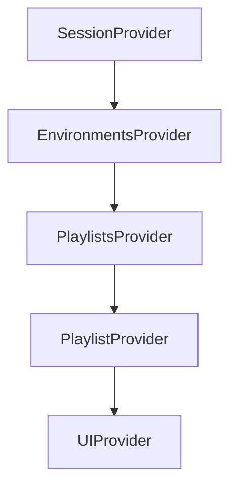
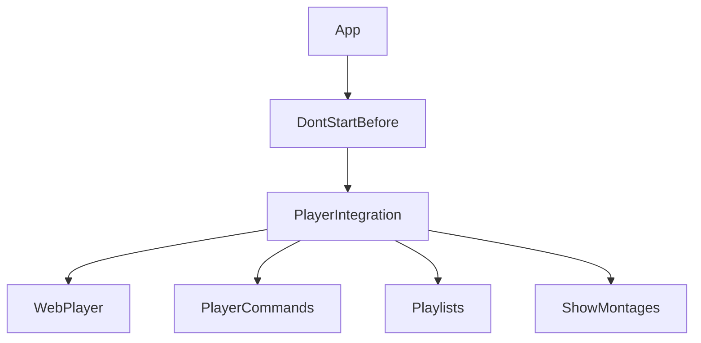

# Wallmuse Player Container Architecture

## 1. Core Context Providers



## 2. Data Flow Hierarchy

```
SessionContext (User/House)
└── EnvironmentsContext (Devices/Screens)
    └── PlaylistsContext (Content)
        └── PlaylistContext (Individual Playlist State)
            └── UIContext (UI State)
```

## 3. Key Components

### SessionContext (`src/contexts/SessionContext.js`)
- User authentication and session state
- Account types: Demo, Guest, Premium
- House information storage
- Flags: `isLoggedIn`, `isDemo`, `isPremium`

### EnvironmentsContext (`src/contexts/EnvironmentsContext.js`)
- Device and screen management
- Playlist synchronization
- Current playlist state
- Environment setup/cleanup

### PlaylistsContext (`src/contexts/PlaylistsContext.js`)
- Playlist data management
- Loading and updates
- State provision to components

### PlaylistContext (`src/Playlists/contexts/PlaylistContext.js`)
- Individual playlist operations
- Save/delete states
- UI feedback

## 4. Component Structure



## 5. Account Structure

```
Account
└── Houses (one house currently)
    └── Environments (devices: PC, mobile, etc.)
        └── Screens (PC: multiple possible, Web: one per browser)
```

**Account Types**:
- **Demo**: Limited functionality, no permissions
- **Guest**: Upgradeable to full account
- **Premium/Free**: Full access (freemium model)

## 6. Data Hierarchy

```
Playlist
└── Montages (sequenced array)
    └── Tracks (sequenced multigraph)
        └── Artworks (VID, IMG, AUD, HTML, TEXT)
```

**Playlist Properties**:
- `id`, `name`, `montages[]`
- `random`: false (default)
- `loop`: false (default)
- Autoplay enabled by default

## 7. Parent-Child Architecture

### Parent (React Container)
- **Location**: WordPress site
- **Responsibilities**: Environment/screen creation via REST API
- **State**: React Context (EnvironmentsContext)
- Creates environments with `crypt_key`

### Child (TypeScript WebPlayer)
- **Location**: Embedded iframe
- **Responsibilities**: Media playback, WebSocket connection
- **State**: Global variables, WebSocket state
- Reads `crypt_key` to establish WebSocket

### Communication
**Parent → Child**:
- URL parameters: `environ`, `screen`, `house`, `session`
- Global variables: `SELECTED_MONTAGE`, `SELECTED_TRACK`
- Events: `webplayer-navigate`

**Child → Parent**:
- Events: `webplayer-fully-ready`
- WebSocket status updates

### Key Point
Parent **cannot** retrieve `crypt_key` from database. WebSocket connections are child-only.

## 8. Environment/Screen Management

### Environment States
- Active: `alive === "1"`
- Inactive: `alive === "0"`

### Screen States
- Active: `on === "1"`
- Inactive: `on === "0"`

### Process
1. Parent creates environment → Backend stores `crypt_key`
2. Parent creates screen → Links to environment
3. Parent activates screen → Sets dimensions
4. Child reads `crypt_key` → Generates WebSocket key
5. Child connects via WebSocket

### Rules
- **One active environment at a time** (prevents conflicts)
- Active environments must have at least one screen
- Screens can be inactive (`on === "0"`) but still valid

## 9. Navigation System

Uses **NavigationManager** (`src/utils/NavigationManager.js`) for parent-child coordination.

See [NAVIGATION_SYSTEM_REFACTOR.md](./NAVIGATION_SYSTEM_REFACTOR.md) for details.

**Key Features**:
- Queue-based command system
- Deduplication logic
- Re-render awareness
- Player readiness coordination

## 10. State Management

See [PLAYER_CONTAINER_STATE_MANAGEMENT.md](./PLAYER_CONTAINER_STATE_MANAGEMENT.md) for patterns.

**Critical Rules**:
- Use functional setState: `setState(current => ...)`
- Complete useMemo/useCallback dependencies
- Send empty params to backend (use `!== undefined` checks)
- Use index-based operations for duplicates

## 11. Troubleshooting

See dedicated troubleshooting docs:
- [PLAYER_CONTAINER_TROUBLESHOOTING.md](../troubleshooting/PLAYER_CONTAINER_TROUBLESHOOTING.md)
- [TROUBLESHOOTING_ACCOUNT_CREATION.md](../troubleshooting/TROUBLESHOOTING_ACCOUNT_CREATION.md)
