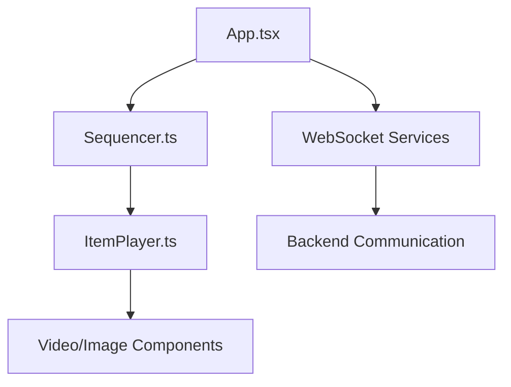

# Wallmuse WebPlayer Development Rules

## 1. Overview

The Wallmuse WebPlayer is a TypeScript-based media playback application that handles real-time media
display, WebSocket communication, and synchronized content playback within the Wallmuse ecosystem.

## 2. Architecture Principles

### 2.1 Core Data Structure

```
Playlist
└── Montages (sequenced array)
    └── Tracks (sequenced multigraph)
        └── Items (sequenced array)
            └── Artworks (title, html, images, video)
```

### 2.2 Component Architecture



## 3. Core Components

### 3.1 App Component (`src/App.tsx`)

**Purpose**: Main React component managing state and rendering **Key Features**:

- Video/image display management
- State coordination
- Media element lifecycle
- User interface rendering

**Key Properties**:

- `videoShown`: Currently displayed video (0, 1, or 2)
- `imageShown`: Currently displayed image (0, 1, or 2)
- `video1/video2`: Video media references
- `image1/image2`: Image media references

### 3.2 Sequencer (`src/manager/Sequencer.ts`)

**Purpose**: Core playback logic and timing management **Key Features**:

- Timeline management
- Position advancement
- Media transitions
- Loop handling

**Key Methods**:

- `play()`: Start playback
- `pause()`: Pause playback
- `showMedia()`: Display specific media
- `goMontage()`: Navigate to specific montage

### 3.3 ItemPlayer (`src/manager/ItemPlayer.ts`)

**Purpose**: Media loading and playback coordination **Key Features**:

- Media file loading
- Playback coordination
- Preloading management
- Error handling

**Key Methods**:

- `playMedia()`: Load and play media
- `delayStart()`: Coordinate media timing
- `preloadNext()`: Preload upcoming media

### 3.4 WebSocket Services (`src/ws/services.ts`)

**Purpose**: Backend communication and real-time updates **Key Features**:

- WebSocket connection management
- Command processing
- State synchronization
- Error recovery

## 4. Data Models

### 4.1 Playlist (`src/dao/Playlist.ts`)

**Purpose**: Manages sequence of montages **Key Properties**:

- `id`: Unique identifier (can be undefined for default)
- `name`: Playlist name
- `montages`: Array of MontageLight objects
- `random`: Boolean for random playback
- `loop`: Boolean for loop playback

**Important**: Default playlists (id: undefined) work exactly like numbered playlists

### 4.2 Montage (`src/dao/Montage.ts`)

**Purpose**: Contains synchronized tracks **Key Properties**:

- `seqs`: Array of Tracks
- `screens`: Array of Screen mappings
- Track synchronization capabilities
- Screen mapping functionality

### 4.3 Item (`src/dao/Item.ts`)

**Purpose**: Represents track element **Key Properties**:

- `artwork_id`: Reference to artwork
- `offset`: Time offset
- `duration`: Playback duration
- `repeat`: Loop count
- `last_repeat_duration`: Final loop duration

### 4.4 Artwork (`src/dao/Artwork.ts`)

**Purpose**: Media content container **Types**: VID, IMG, AUD, HTML, TEXT **Key Properties**:

- `title`: Content title
- `type`: Media type
- `url`: Media location
- `width/height`: Dimensions
- `duration`: Playback length

## 5. Communication Architecture

### 5.1 Parent-Child Communication

**CRITICAL**: All communication flows through NAV commands, not URL parameters

```
Parent Application (NavigationManager.js)
└── NAV Commands via 'webplayer-navigate' events
    └── React Webplayer (index.tsx)
        └── WebSocket data delivery
            └── Sequencer execution
```

### 5.2 Communication Mechanisms

1. **NAV Commands**: Primary communication method
2. **WebSocket**: Real-time data delivery
3. **Global Variables**: Cross-application state sharing
4. **Event System**: Bidirectional communication

### 5.3 Environment Integration

- **Parent**: Creates environments and screens via REST API
- **Child**: Generates keys and establishes WebSocket connections
- **Security**: Parent cannot retrieve crypt_key (by design)

## 6. Development Standards

### 6.1 Code Conventions

- **No comments** unless explicitly requested
- **Consistent logging prefixes**: `[ComponentName.methodName]`, `[GUARD-CHECK]`, `[WS-COMMAND]`
- **Defensive programming**: Check for null/undefined before accessing properties
- **Clear variable names**: Descriptive names indicating purpose
- **Type safety**: Use TypeScript types, avoid `any` where possible

### 6.2 State Management

- Use React hooks for local state
- Implement proper cleanup in useEffect
- Handle loading and error states consistently
- Minimize unnecessary re-renders

### 6.3 Error Handling

- Implement comprehensive error boundaries
- Provide user-friendly error messages
- Log errors with appropriate context
- Implement graceful degradation

## 7. Media Playback System

### 7.1 Video Streaming Configuration

- **Fragment System**: Enabled by default (`withFragments = true`)
- **Chunk Size**: 512KB segments for optimal performance
- **Server Support**: Confirmed working with HTTP Range requests
- **CORS Headers**: Properly configured for video streaming

### 7.2 Expected Connection Errors (Normal)

**CRITICAL**: These console errors are NORMAL for chunked video delivery:

```
GET https://manager.wallmuse.com:8444/wallmuse/ws/s3_get_file/uuid-[...].mp4?version=1
net::ERR_CONNECTION_CLOSED 206 (Partial Content)
```

**Why These Occur**:

- HTTP Range Requests: Each chunk is a separate request/response
- Connection Management: Server closes connections after each chunk
- 206 Partial Content: Correct response indicating success
- Browser Retry Logic: Browser automatically requests next chunk

### 7.3 Media Loading Patterns

- **Double Buffering**: Two video elements for smooth transitions
- **Preloading**: Load next media 1.5 seconds before transition
- **Loading Locks**: Prevent multiple simultaneous loads
- **AbortError Handling**: Normal behavior during transitions

### 7.4 Video Volume Control **UPDATED: 2025-12-26**

**CRITICAL RULE**: Only the visible video element should have volume and be unmuted

- **Hidden Video Slot**: Always muted with `volume = 0`
- **Visible Video Slot**: Receives volume commands from WebSocket
- **Volume Commands**: Only applied to `this.state.videoShown` element
- **Audio Overlap Prevention**: Explicit muting prevents dual audio playback

**Implementation Pattern**:
```typescript
if (videoShown === 1 && this.video1Ref.current) {
  this.video1Ref.current.volume = normalizedVolume;
  this.video1Ref.current.muted = false;
  // Explicitly mute the other slot
  if (this.video2Ref.current) {
    this.video2Ref.current.muted = true;
    this.video2Ref.current.volume = 0;
  }
}
```

**Reference**: See [App.tsx:1036-1067](../../src/App.tsx#L1036-L1067) for full implementation

## 8. Track Management System **UPDATED: 2025-12-27**

### 8.1 Track Selection Priority

1. **Navigation parameters (Parent prevails)**: Track from parent NAV commands takes absolute priority
2. **Montage-specific override**: Previously set track for specific montage (by montage ID)
3. **Track continuity**: Same track as currently playing montage
4. **Montage default**: Fallback track from montage.getTrackIndex()

**Reference**: See [index.tsx:746-763](../../src/index.tsx#L746-L763) for implementation

### 8.2 Track Storage System (ID-Based)

**CRITICAL**: Track overrides stored by **montage ID** (not position) to survive playlist reordering

```typescript
// Sequencer.ts
private static montageTrackOverrides: Map<string, number> = new Map();
// Example: "1552" → 1 (Entre-deux Seines → Track 2, 0-based)
```

**Why ID-based?**
- Montage position changes during playlist reordering
- Montage ID remains stable
- Track mappings survive reorder operations

**Reference**: See [Sequencer.ts:36-42](../../src/manager/Sequencer.ts#L36-42) for storage declaration

### 8.3 Track Indexing Convention

- **UI/Server**: 1-based indexing (Track 1, Track 2, Track 3)
- **Internal Code**: 0-based indexing (0, 1, 2)
- **Conversion**: `trackIndex = parseInt(track) - 1`

### 8.4 Peer Synchronization for Track Changes

Track assignments synchronized across all screens in house cluster via WebSocket:

**Same Browser (Parent Prevails)**:
1. User changes track → Parent applies immediately
2. Parent sends track mappings by montage ID
3. WebPlayer stores override: `Map.set(montageId, trackIndex)`

**Peer Browsers (WebSocket Sync)**:
1. Server broadcasts environment update with screen assignments
2. WebSocket detects track assignment change
3. Extracts track from montage.screens[screenId].seq_refs
4. Updates track override and navigates: `goMontage(position, newTrack)`

**Reference**: See [ws-tools.ts:583-725](../../src/ws/ws-tools.ts#L583-L725) for peer sync implementation

### 8.5 Montage Signature & Reorder Detection

**Signature**: Identifies montage order in playlist
```javascript
signature = playlist.montages.map(m => m.id).join('-');
// Example: "1552-1559-1450"
```

**Reorder Detection**: When signature changes, reload current position with new montage order

**Why Important**: After reordering, position 1 might have a different montage. Track mappings remain valid because they use montage ID.

**Reference**: See [ws-tools.ts:648-660](../../src/ws/ws-tools.ts#L648-L660) for signature generation

### 8.6 Complete Track Management Documentation

For comprehensive documentation including:
- Source of truth architecture (server database vs environment config)
- Data flow diagrams
- Peer synchronization details
- Implementation code pointers
- Troubleshooting guide

**See**: [Track Management Architecture](./TRACK_MANAGEMENT_ARCHITECTURE.md) ✏️ *New 2025-12-27*

## 9. Performance Optimization

### 9.1 Memory Management

- Clear unused media references during playlist switches
- Use loading locks to prevent resource exhaustion
- Implement proper cleanup in component unmounting
- Monitor for memory leaks

### 9.2 Network Optimization

- Throttle WebSocket keep-alive messages (max 1/second)
- Prevent duplicate media loading operations
- Use preloading efficiently (1.5 seconds before transition)
- Implement request deduplication

### 9.3 Rendering Performance

- Avoid setState during render cycles (use setTimeout)
- Implement proper shouldComponentUpdate logic
- Minimize DOM manipulation during media transitions
- Use React.memo for expensive components

## 10. Testing and Debugging

### 10.1 Debug Commands

```javascript
// System state inspection
window.debugPlayer();
window.debugSequencerStatus();

// Media analysis
window.debugMediaConflicts();
window.forceCleanState();

// Container monitoring
window.monitorContainerDestruction();
```

### 10.2 Test Benchmarks

1. **Play/Pause/Stop**: UI buttons must affect actual playback
2. **Track Navigation**: Next/Previous buttons work correctly
3. **Playlist Switching**: Different playlists load and display media
4. **goMontage Functionality**: Direct montage navigation works

### 10.3 Log Filtering Patterns

- `[TRACK-TIMING]`: Track selection debugging
- `[SEQUENCER]`: Core sequencer operations
- `[APP-STATE]`: React component state changes
- `[WS-COMMAND]`: WebSocket command processing
- `[MEDIA-LOAD]`: Media loading and display

## 11. Deployment Configuration

### 11.1 Build Process

- **Development**: `webplayer2B` branch for testing
- **Production**: `webplayer2` branch for stable releases
- **Build Command**: `npm run build`
- **Deploy Method**: rsync scripts to WordPress environment

### 11.2 Environment Variables

- **REACT_APP_ROOTWS**: WebSocket server URL
- **REACT_APP_ROOTURL**: HTTP server URL
- **NODE_ENV**: Environment mode (development/production)

### 11.3 Dependencies

- **React 18**: Core framework
- **TypeScript**: Type safety and development experience
- **Material-UI**: UI components (if used)
- **WebSocket**: Real-time communication

---

## Appendix A: Troubleshooting Guide

_See [WEBPLAYER_TROUBLESHOOTING.md](./WEBPLAYER_TROUBLESHOOTING.md) for detailed troubleshooting
information including:_

- Common playback issues and solutions
- WebSocket connection problems
- Media loading failures
- Track navigation issues
- Performance optimization techniques
- Debug procedures and recovery mechanisms
